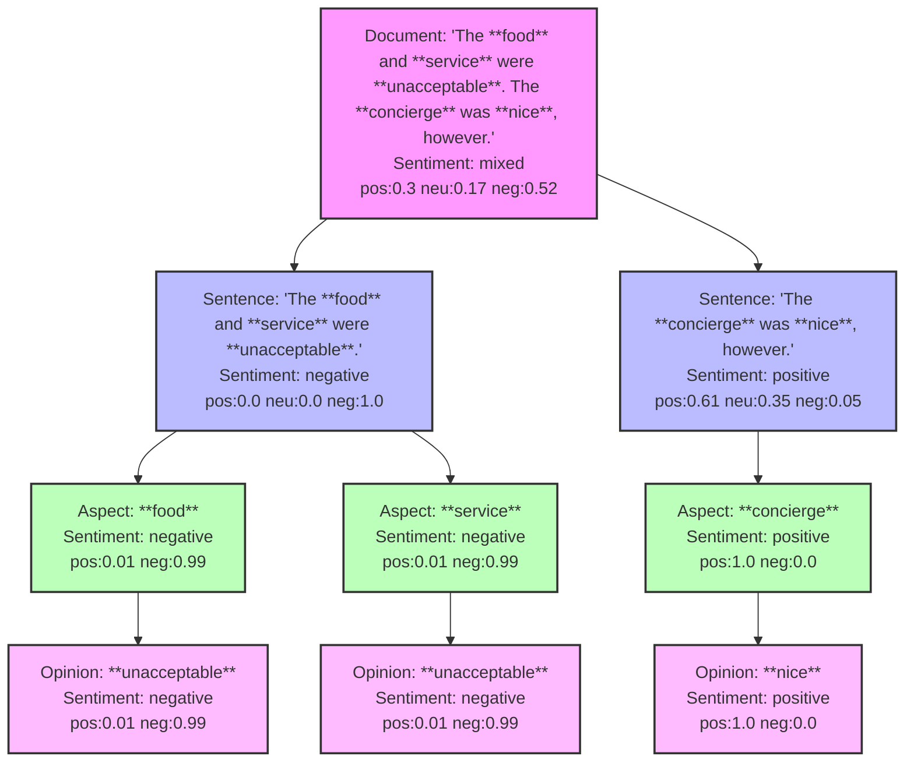

# Azure Sentiment Analysis in Excel
November 1, 2024

## Background

Azure Sentiment Analysis is a cloud-based service, part of [Azure AI Language](https://learn.microsoft.com/en-us/azure/ai-services/language-service/sentiment-opinion-mining/overview?tabs=prebuilt), that uses machine learning to analyze text for sentiment and opinions.  It returns an array containing the sentiment analysis results with sentiment polarity at the document, sentence, and aspect levels. It also provides the opinions used at the aspect level.  This is often referred to as [aspect-based sentiment analysis](https://paperswithcode.com/task/aspect-based-sentiment-analysis).

For example, given the text "I love the food, but the service was terrible", instead of just getting a single sentiment score, which in this case isn't that useful,  we can extract the sentiment for each aspect, such as `food` = positive and `service` = negative.

The table below is a contrived example where the aspects have purposely been made to relate to either a `food` or `service` type aspect.  These aspects were not extracted by the Azure Sentiment Analysis service, but are used here to illustrate the concept of aspect-based sentiment analysis. 

| Review | "Food" Aspect | "Service" Aspect |
|--------|------------------|---------------------|
| "The pizza was amazing but our waitress seemed uninterested" | pizza | waitress |
| "Delicious pasta, though service was slow tonight" | pasta | service |
| "The cuisine is outstanding but the staff was rude" | cuisine | staff |
| "Bland menu items and the waiter forgot our order" | menu items | waiter |
| "Great appetizers but long wait times for seating" | appetizers | wait times |
| "Fresh ingredients, friendly servers made our night" | ingredients | servers |
| "Tasty dishes but poor customer service experience" | dishes | customer service |
| "Mediocre food quality and inattentive waitstaff" | food quality | waitstaff |
| "Excellent menu selection, prompt table service" | menu selection | table service |
| "Superb entrees but slow kitchen and rude host" | entrees | kitchen/host |

Notice how the words used to describe `food` and `service` related aspects are varied, so trying to group them by keyword isn't practical as the following different words are used for `food`: pizza, pasta, cuisine, menu items, appetizers, ingredients, dishes, food quality, menu selection, entrees.

To properly summarize the results we need to group the aspects together using [semantic similarity](https://en.wikipedia.org/wiki/Semantic_similarity), typically into clusters of related words.  This is beyond the scope of this article.

## Python Function

To access the Azure Sentiment Analysis service from Excel, we're going to create a Python function that calls the Azure API and returns the sentiment analysis results.  We'll use the `azure-ai-textanalytics` Python library which provides a simple interface to the Azure Text Analytics service.  In our function we'll pass in the array of text to analyze, the Azure key, and the Azure endpoint.  We want the results in a tabular format, so we need to flatten the structure so that each row contains the sentiment analysis results for a single aspect, and thus there are multiple rows per review.

```python
from azure.ai.textanalytics import TextAnalyticsClient
from azure.core.credentials import AzureKeyCredential

def azure_sentiment(documents, language_key, language_endpoint):
    # Check if documents is a string, list, or DataFrame
    if isinstance(documents, str):
        documents = [documents]
    elif isinstance(documents, pd.DataFrame):
        documents = documents.values.flatten().tolist()  # Convert df to list

    # Authenticate the client using your key and endpoint 
    ta_credential = AzureKeyCredential(language_key)
    client = TextAnalyticsClient(
            endpoint=language_endpoint, 
            credential=ta_credential)

    result = client.analyze_sentiment(documents, show_opinion_mining=True)
    doc_result = [doc for doc in result if not doc.is_error]

    data = []

    for idx, document in enumerate(doc_result):
        for sentence in document.sentences:
            for mined_opinion in sentence.mined_opinions:
                target = mined_opinion.target
                for assessment in mined_opinion.assessments:
                    data.append([
                        idx + 1,  # 1-based index
                        document.sentiment,
                        document.confidence_scores.positive,
                        document.confidence_scores.neutral,
                        document.confidence_scores.negative,
                        sentence.text,
                        sentence.sentiment,
                        sentence.confidence_scores.positive,
                        sentence.confidence_scores.neutral,
                        sentence.confidence_scores.negative,
                        target.text,
                        target.sentiment,
                        target.confidence_scores.positive,
                        target.confidence_scores.negative,
                        assessment.text,
                        assessment.sentiment,
                        assessment.confidence_scores.positive,
                        assessment.confidence_scores.negative
                    ])
    return data

azure_sentiment(arg1, arg2, arg3)
```

## Output

The figure below illustrates an example of the results returned by the Azure Sentiment Analysis service for a single document that contains two sentences as follows: `The food and service were unacceptable. The concierge was nice, however..`.



The results are then flattened or denormalized into a tabular format where each row contains the sentiment analysis results for a single aspect and duplicates the parent sentence and document.  The columns in the output include the document index, document sentiment, document confidence scores, sentence text, sentence sentiment, sentence confidence scores, aspect text, aspect sentiment, aspect confidence scores, opinion text, opinion sentiment, and opinion confidence scores.

## Excel Integration

To run this function from Excel we need to use the `BOARDFLARE.RUNPY` function which is available in the [Boardflare Python for Excel add-in](/apps/excel/python).  This function allows you to run Python code from Excel and return the results in a tabular format.  The `BOARDFLARE.RUNPY` function takes a path to the Python code as the first argument, followed by the arguments to pass to the Python function.

```excel
=BOARDFLARE.RUNPY("text/sentiment-analysis/azure_sentiment.ipynb", A1:A10, "your-azure-key", "your-azure-endpoint")
```
The documentation for the `azure_sentiment` function is available [here](/functions/text/sentiment-analysis/azure_sentiment).

## Results

As shown in the workbook, running the table of reviews earlier through the Azure Sentiment Analysis generates the following high-level sentiment analysis results:

| Sentence | Aspect | Opinion |
|:---|:---|:---|
| The pizza was amazing but our waitress seemed uninterested | pizza | amazing |
| The pizza was amazing but our waitress seemed uninterested | waitress | uninterested |
| Delicious pasta, though service was slow tonight | pasta | Delicious |
| Delicious pasta, though service was slow tonight | service | slow |
| The cuisine is outstanding but the staff was rude | cuisine | outstanding |
| The cuisine is outstanding but the staff was rude | staff | rude |
| Bland menu items and the waiter forgot our order | menu items | Bland |
| Bland menu items and the waiter forgot our order | waiter | forgot |
| Great appetizers but long wait times for seating | appetizers | Great |
| Fresh ingredients, friendly servers made our night | ingredients | Fresh |
| Fresh ingredients, friendly servers made our night | servers | friendly |
| Tasty dishes but poor customer service experience | dishes | Tasty |
| Tasty dishes but poor customer service experience | customer service experience | poor |
| Mediocre food quality and inattentive waitstaff | food quality | Mediocre |
| Mediocre food quality and inattentive waitstaff | waitstaff | inattentive |
| Excellent menu selection, prompt table service | menu selection | Excellent |
| Excellent menu selection, prompt table service | table service | prompt |
| Superb entrees but slow kitchen and rude host | entrees | Superb |
| Superb entrees but slow kitchen and rude host | kitchen | slow |
| Superb entrees but slow kitchen and rude host | host | rude |

Most of the columns in the output were omitted for brevity.

## Conclusion

In this article we have shown how to use the Azure Sentiment Analysis service from Excel to analyze sentiment and opinions in text.  We have also shown how to flatten the results into a tabular format so that they can be easily analyzed in Excel.  This is a powerful tool for analyzing sentiment in text data, and can be used in a variety of applications such as customer support, market research, finance, etc.  We have left the task of summarizing the results into clusters of related aspects as an exercise for the reader. 


