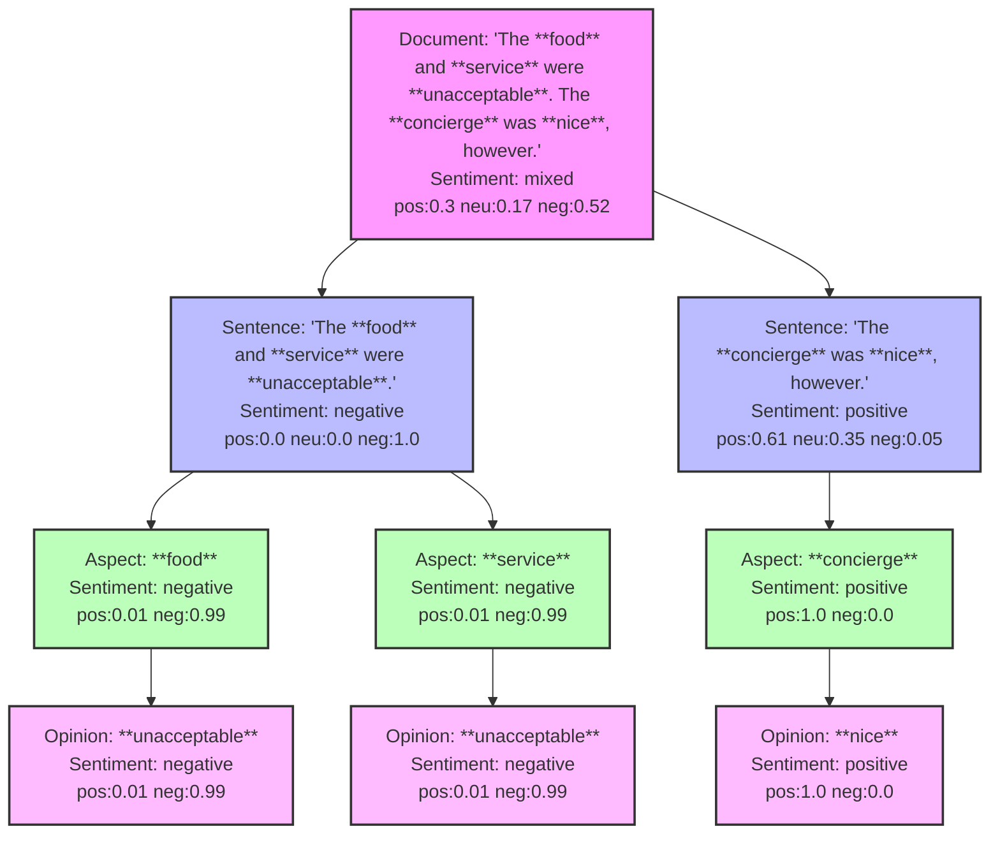

# Sentiment Analysis

## Overview

[Sentiment analysis](https://paperswithcode.com/task/sentiment-analysis) classifies text as having positive or negative overall sentiment, and is commonly used in customer support, market research, finance, etc.  Click on a buttons below to get started with the Excel or Sheets extension.

### Spreadsheet Apps

Both of these apps currently use simple [classification models](#classification-models) as outlined below.

- [Sentiment Analysis for Excel](/apps/excel/sentiment-analysis)
- [Sentiment Analysis for Sheets](/apps/sheets/sentiment-analysis)

### Python Functions

- [azure_sentiment](/functions/text/sentiment-analysis/azure_sentiment).  Uses the [Azure AI Language](https://learn.microsoft.com/en-us/azure/ai-services/language-service/sentiment-opinion-mining/overview?tabs=prebuilt) service to analyze sentiment and opinions in the provided documents. It returns an array containing the sentiment analysis results with sentiment polarity at the document, sentence, and aspect levels. It also provides the opinions used at the aspect level.

## Classification Models

Traditional sentiment analysis is performed using transformer machine learning models which have been trained on datasets (e.g. movie reviews, tweets, etc.) where the sentiment (e.g. positive, negative) has been labeled by human annotators.  The accuracy of the model depends on how similar your text is to the data the model was trained on.  The pretrained sentiment analysis models currently available are shown in the table below:

| Name | Model | Training Data | Output Labels | Language |
| :--- | :---- | :---------- | :---------- | :---------- |
| Movie Reviews | [distilbert-base-uncased-finetuned-sst-2-english](https://huggingface.co/distilbert/distilbert-base-uncased-finetuned-sst-2-english) | Movie review phrases from the [Stanford Sentiment Treebank](https://paperswithcode.com/dataset/sst) dataset. | Positive, Negative | English |
| Finance News| [finbert](https://huggingface.co/ProsusAI/finbert) | Financial phrases from the [financial phrasebank dataset](https://huggingface.co/datasets/financial_phrasebank). | Positive, Negative, Neutral | English |
| Twitter Messages | [twitter-roberta-base-sentiment-latest](https://huggingface.co/cardiffnlp/twitter-roberta-base-sentiment-latest) | ~124M tweets from the [TweetEval](https://github.com/cardiffnlp/tweeteval) dataset. | Positive, Negative, Neutral | English |
| Product Reviews | [bert-base-multilingual-uncased-sentiment](https://huggingface.co/nlptown/bert-base-multilingual-uncased-sentiment) | Trained on multilingual product reviews. | 1 - 5 stars | English, Dutch, German, French, Spanish, and Italian |

Note the following limitations:

- Accuracy: Sentiment analysis is far from an exact science.  The presence of sarcasm, irony, negation, and emojis often confuses sentiment analysis models and leads to errors.
- Text length: The models have a maximum input length of about 500 tokens (400 words), so any additional text may be truncated.  Sentence splitting may be a workaround for this limitation.
- Language: The models are mostly trained on English text, except where noted, so the accuracy of sentiment analysis will be lower for other languages.

## Aspect-Based Sentiment Analysis

Aspect-based sentiment analysis (ABSA) is a more advanced form of sentiment analysis that identifies the sentiment of specific aspects or entities within a text.  For example, in the sentence "The food was great, but the service was terrible", the aspects are "food" and "service", and the sentiment is positive for "food" and negative for "service".  The following tools can be used for aspect-based sentiment analysis:

- [Azure AI Language](https://learn.microsoft.com/en-us/azure/ai-services/language-service/sentiment-opinion-mining/overview?tabs=prebuilt) provides sentiment analysis and opinion mining at the document, sentence, and aspect levels.  See our blog post on [Azure Sentiment Analysis in Excel](/blog/2024/azure-sentiment-analysis) for more information.

- [InstructABSA](https://github.com/kevinscaria/InstructABSA) is an instructional learning approach for Aspect-Based Sentiment Analysis. It can be used to run inference on your datasets directly or be trained from scratch. The tool can classify sentiment at the aspect level, providing detailed sentiment analysis.

- [SetFit](https://github.com/huggingface/setfit) is a framework for few-shot fine-tuning of Sentence Transformers. It achieves high accuracy with minimal labeled data and is efficient for sentiment analysis tasks, making it a suitable choice for integrating sentiment analysis into various applications.

An example output of aspect-based sentiment analysis using the Azure AI Language service is shown in the figure below.

## Applications

- Customer Support: Automatically categorize incoming support tickets as positive, negative, or neutral.
- Market Research: Analyze social media posts to gauge public sentiment about a product or service.
- Finance: Monitor news articles for sentiment about a company or industry.
- Education: Analyze student feedback to improve course content and delivery.
- Healthcare: Analyze patient feedback to improve services and patient outcomes.

## Cloud Services

If you need to integrate sentiment analysis into a real-time workflow (e.g. analyze sentiment of support tickets for routing), you'll need to use an API which processes the text and returns the sentiment analysis results.

The open source models we use in our tools are downloaded from [Hugging Face](https://huggingface.co/models), which provides a large collection of pre-trained models for natural language processing tasks, including sentiment analysis. They also offer [Inference Endpoints](https://huggingface.co/docs/inference-endpoints/index) whereby the same models can be used via API.  This is a good option if you want to use the same models we use in our tools, but need to integrate them into your own applications.

Here are some additional API providers which offer sentiment analysis:

- [MonkeyLearn](https://www.monkeylearn.com/)
- [MeaningCloud](https://www.meaningcloud.com/)
- [Rosette](https://www.rosette.com/)
- [Lexalytics](https://www.lexalytics.com/)
- [Google Cloud Natural Language API](https://cloud.google.com/natural-language)
- [IBM Watson](https://www.ibm.com/watson/services/natural-language-understanding/)
- [Microsoft Azure AI Language](https://azure.microsoft.com/en-us/services/cognitive-services/text-analytics/)
- [Amazon Comprehend](https://aws.amazon.com/comprehend/)